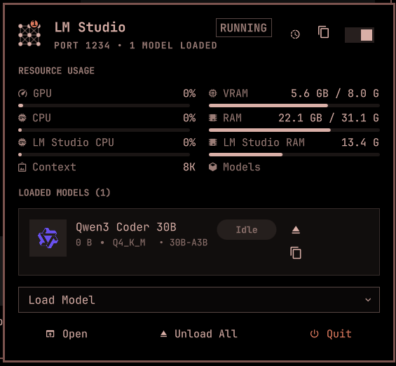

# LM Studio Plugin for Omarchy

Fork of [25cent9/omarchy-lmstudio-plugin](https://github.com/25cent9/omarchy-lmstudio-plugin). The bar and panel share one service, and `lms` runs one command at a time so polling does not start extra LM Studio processes.

Monitor and control the LM Studio server from the Omarchy Quattro bar: start/stop the server, load/unload models, copy identifiers and the LLM base URL, and watch live GPU/CPU/RAM usage — all in a menu-style panel mirroring the native LM Studio tray card.



## Features

- **Bar widget**: LM Studio server status icon (running/stopped), model count badge, warning state
- **Menu-style panel**: Mirrors the native LM Studio hover card
  - Open LM Studio (launches the GUI app)
  - Copy LLM Server Base URL (header button)
  - Load Model (searchable dropdown of on-disk models)
  - Unload All Models
  - Quit LM Studio
  - Start/stop server toggle in the header
- **Loaded models list**: Display name, memory, quantization/architecture, params, status badge, per-model unload and copy (name or identifier)
- **Publisher logos**: Model cards show the publisher's brand logo from [Simple Icons](https://simpleicons.org) (CC0), like LM Studio's model picker — e.g. Gemma shows the Google logo. Publishers without an icon (or offline) get a deterministic colored initial tile; no request is made until the panel is first opened, and only the publisher slug is sent to `cdn.simpleicons.org`
- **Live resource monitor**: GPU utilization, VRAM, system CPU/RAM, per-process LM Studio CPU/RAM, plus context-window and model-count cells — polled directly from the OS (nvidia-smi, `/proc/meminfo`, `/proc/stat`), btop-style two-sample CPU deltas
- **Keyboard navigation**: Full cursor-driven navigation across header → models → actions
- **Optimistic UI**: Instant feedback when toggling server (like Tailscale plugin)
- **Auto-refresh**: Configurable interval with startup ramp
- **Settings**: Custom LMS CLI path, refresh interval

## Install

```sh
omarchy plugin add https://github.com/design-nexus/omarchy-lmstudio-plugin.git --enable
```

Or for local development:

```sh
# Plugin is already at ~/.config/omarchy/plugins/design-nexus.lmstudio
omarchy plugin enable design-nexus.lmstudio
```

## Uninstall

```sh
omarchy plugin remove design-nexus.lmstudio
```

This disables the plugin and removes it from `~/.config/omarchy/plugins/design-nexus.lmstudio`. No user configuration is modified outside the plugin's own folder.

## Usage

| Action | Method |
|--------|--------|
| Open/close panel | Click bar icon (left click) |
| Toggle server | Right-click bar icon, `S` in panel, or the header toggle |
| Refresh status | Middle-click bar icon, or press `R` in panel |
| Open LM Studio | `Open` footer button, or press `O` |
| Copy base URL | Header copy button |
| Load model | `Load Model` dropdown (searchable, keyboard-friendly) |
| Navigate | ↑/↓ arrows in panel (header → models → actions) |
| Unload model | Select model, press `U` (or per-model button / `Unload All` footer) |
| Copy model name | Select model, press `C` |
| Copy model identifier | Select model, press `I` |
| Quit LM Studio | `Quit` footer button, or press `Q` |
| Copy menu | ↑/↓ or `j`/`k` to choose, Enter to copy, Escape to close |
| Close panel | Escape |

## Requirements

- [LM Studio](https://lmstudio.ai/) installed with the `lms` CLI (default: `~/.lmstudio/bin/lms`, or set a custom path in settings)
- Omarchy with Quattro shell (quickshell)
- `wl-copy` (package: wl-clipboard) for the copy actions (base URL, model name/identifier)
- `gtk-launch` (package: glib2) for launching the LM Studio GUI app
- `nvidia-smi` for GPU/VRAM metrics (falls back to `—` if absent; system CPU/RAM always work)

## Configure

```sh
# Move to different bar section
omarchy bar move design-nexus.lmstudio --section right

# Change refresh interval (via plugin settings UI or config)
# Set custom LMS path if not at ~/.lmstudio/bin/lms
```

## Development

```sh
# Validate plugin
omarchy plugin validate ~/.config/omarchy/plugins/design-nexus.lmstudio
qmllint -I $OMARCHY_PATH/shell ~/.config/omarchy/plugins/design-nexus.lmstudio/Panel.qml ~/.config/omarchy/plugins/design-nexus.lmstudio/Service.qml

# Test panel
omarchy-shell shell summon design-nexus.lmstudio '{}'
omarchy-shell shell hide design-nexus.lmstudio

# Rescan after changes
omarchy-shell shell rescanPlugins
```

## File Structure

```
~/.config/omarchy/plugins/design-nexus.lmstudio/
├── manifest.json       # Plugin manifest
├── Model.js            # Pure JS parsing + resource polling script (shared)
├── Service.qml         # Headless service (CLI calls, state, resource polling)
├── Panel.qml           # Bar widget entry point (loads PanelContent.qml)
├── PanelContent.qml    # Panel UI (menu-style actions, models, resource grid)
├── PublisherLogo.qml   # Publisher brand logo / initial-tile fallback
├── LMStudioIcon.qml    # Bar icon component
├── images/             # Screenshots used in this README
├── README.md           # This file
└── LICENSE             # MIT License
```

## Architecture

Follows the **Tailscale plugin pattern**:
- Single `bar-widget` kind with `Panel.qml` as entry point
- `Service.qml` as the one CLI client. The bar and the panel share it, and `lms` calls run one at a time so a status poll cannot start a second LM Studio
- `Model.js` for pure parsing logic (testable in isolation)
- `KeyboardPanel` with cursor-driven navigation
- Optimistic toggle state (`_desiredServerState`) for instant UI feedback

## License

MIT License - see LICENSE file.